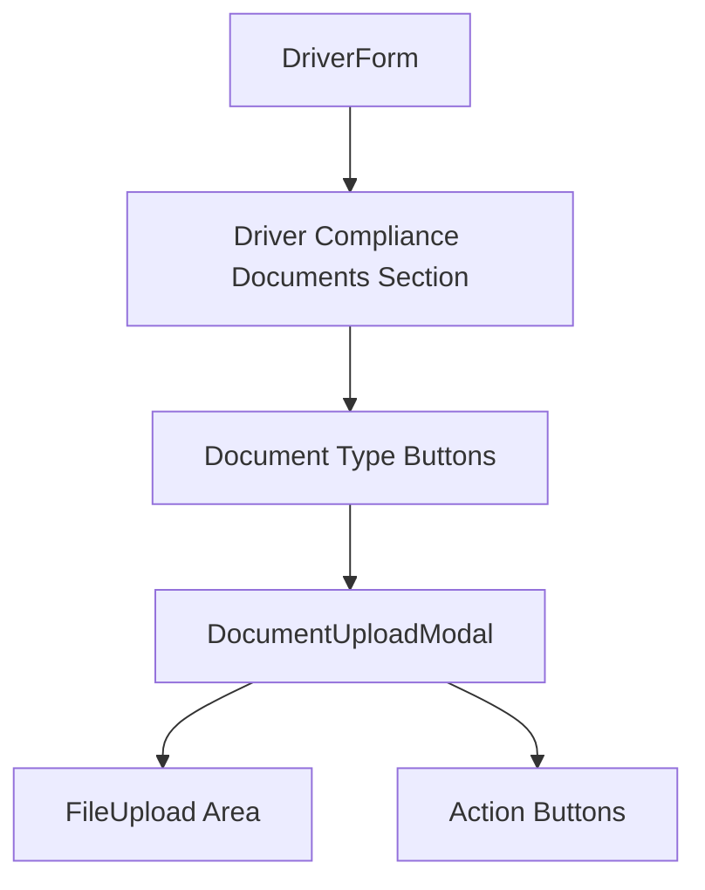

# Design Document: Driver Compliance Documents

## Overview

This feature adds a Driver Compliance Documents section to the DriverForm component and introduces a reusable DocumentUploadModal component. The section allows truck operators to upload required driver licenses and certifications (Driver License, White Card, VOC, High Risk Work License). The modal component is designed to be reusable across the entire application for various document upload scenarios.

## Architecture

The feature follows the existing component architecture patterns in the codebase:

```
src/
├── components/
│   ├── common/
│   │   └── DocumentUploadModal/
│   │       ├── index.tsx           # Reusable modal component
│   │       └── DocumentUploadModal.css  # Modal styles
│   └── forms/
│       └── DriverForm/
│           └── index.tsx           # Updated with compliance section
```

### Component Hierarchy



## Components and Interfaces

### 1. DocumentUploadModal Component

A reusable modal component for uploading documents with drag-and-drop functionality.

```typescript
interface DocumentUploadModalProps {
  isOpen: boolean;
  onClose: () => void;
  onUpload: (file: File) => void;
  title?: string;
  description?: string;
  acceptedFormats?: string;
  maxSizeMB?: number;
}
```

**Props:**
- `isOpen`: Controls modal visibility
- `onClose`: Callback when modal is closed (cancel, backdrop click, or after upload)
- `onUpload`: Callback with the selected file when upload is confirmed
- `title`: Modal title (default: "Upload Document")
- `description`: Instructional text (default: "Choose the document you want to upload...")
- `acceptedFormats`: File types accepted (default: ".jpg,.jpeg,.pdf")
- `maxSizeMB`: Maximum file size in MB (default: 10)

### 2. Driver Compliance Documents Section

A section within DriverForm that displays document type buttons.

```typescript
interface ComplianceDocument {
  id: string;
  type: 'driverLicense' | 'whiteCard' | 'voc' | 'highRiskWorkLicense';
  label: string;
  file: File | null;
  uploaded: boolean;
}

const DOCUMENT_TYPES = [
  { id: 'driverLicense', label: 'Driver License' },
  { id: 'whiteCard', label: 'White Card' },
  { id: 'voc', label: 'VOC (Verification of Competency)' },
  { id: 'highRiskWorkLicense', label: 'High Risk Work License' },
] as const;
```

## Data Models

### Document State

```typescript
interface DocumentState {
  [documentType: string]: {
    file: File | null;
    uploaded: boolean;
    uploadedAt: Date | null;
  };
}
```

### Modal State

```typescript
interface ModalState {
  isOpen: boolean;
  activeDocumentType: string | null;
  selectedFile: File | null;
  isDragActive: boolean;
  error: string | null;
}
```

## Correctness Properties

*A property is a characteristic or behavior that should hold true across all valid executions of a system-essentially, a formal statement about what the system should do. Properties serve as the bridge between human-readable specifications and machine-verifiable correctness guarantees.*

Based on the acceptance criteria analysis, the following correctness properties must be maintained:

### Property 1: Document button click opens modal
*For any* document type button in the compliance section, clicking it SHALL open the DocumentUploadModal with the modal's isOpen state set to true.
**Validates: Requirements 2.1**

### Property 2: Custom props override defaults
*For any* custom title and description props passed to DocumentUploadModal, the rendered modal SHALL display the provided values instead of the default values.
**Validates: Requirements 3.1, 3.2**

### Property 3: Drag feedback activation
*For any* drag event over the upload area, the system SHALL add visual feedback (drag-active class) when dragging over and remove it when dragging out.
**Validates: Requirements 4.2**

### Property 4: Valid file acceptance
*For any* valid file (matching accepted formats and size constraints) dropped or selected, the system SHALL accept the file and store it in the selected file state.
**Validates: Requirements 4.3**

### Property 5: Cancel closes without upload
*For any* modal state with or without a selected file, clicking the Cancel button SHALL close the modal and NOT trigger the onUpload callback.
**Validates: Requirements 5.1**

### Property 6: Upload processes valid file
*For any* valid file selected in the modal, clicking the Upload File button SHALL call the onUpload callback with the selected file.
**Validates: Requirements 5.2**

### Property 7: Modal close resets state
*For any* method of closing the modal (cancel, backdrop click, successful upload), the modal's internal state SHALL reset to initial values (selectedFile: null, error: null, isDragActive: false).
**Validates: Requirements 5.4**

### Property 8: Uploaded document visual distinction
*For any* document type that has been successfully uploaded, the corresponding button SHALL have a visual distinction (different styling) from buttons without uploads.
**Validates: Requirements 6.1**

## Error Handling

### File Validation Errors
- **Invalid format**: Display "Only jpg, jpeg, and pdf files are supported"
- **File too large**: Display "File size must be less than {maxSizeMB}MB"
- **No file selected**: Disable Upload button when no file is selected

### Modal Error States
- Errors are displayed within the modal below the upload area
- Errors are cleared when a new file is selected or when the modal is closed

## Testing Strategy

### Unit Testing
Unit tests will verify specific examples and edge cases:
- Modal renders with default props
- Modal renders with custom props
- Document type buttons render correctly
- File input triggers on click
- Backdrop click closes modal

### Property-Based Testing
Property-based tests will use `fast-check` library to verify universal properties:
- Each correctness property will have a corresponding property-based test
- Tests will generate random inputs to verify properties hold across all valid inputs
- Minimum 100 iterations per property test

**Test Annotations:**
Each property-based test MUST be tagged with:
- `**Feature: driver-compliance-documents, Property {number}: {property_text}**`
- `**Validates: Requirements X.Y**`

### Test File Structure
```
src/
├── components/
│   ├── common/
│   │   └── DocumentUploadModal/
│   │       ├── index.tsx
│   │       ├── DocumentUploadModal.css
│   │       └── DocumentUploadModal.test.tsx  # Unit + Property tests
│   └── forms/
│       └── DriverForm/
│           ├── index.tsx
│           └── DriverForm.test.tsx  # Integration tests
```

### Testing Framework
- **Unit Tests**: Jest + React Testing Library
- **Property-Based Tests**: fast-check
- **Minimum iterations**: 100 per property test
